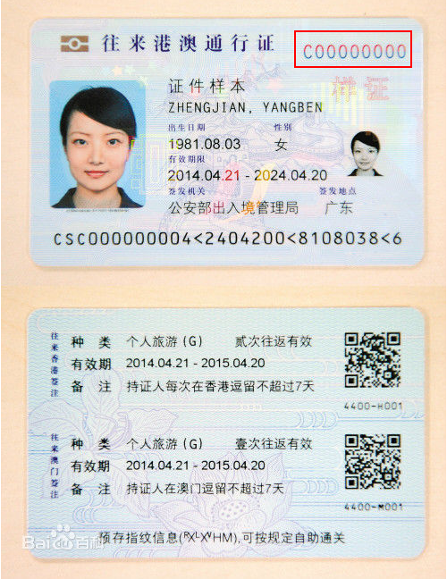

## 代码
``` js
	/^[CW]\d{8}$/
```

## 正则分析
[在线分析-港澳通行证](https://regexper.com/?#%2F%5E%5BCW%5D%5Cd%7B8%7D%24%2F "在线分析-港澳通行证")


## 规则说明

| 类型 | 说明                       | 备注                                       |
| :--- | :------------------------- | :----------------------------------------- |
|      | 开头是大写的英文`C`或者`W` | C表示电子版的，也就是电子卡。W表示办的本子 |
|      | 后面是8位数字              |                                            |



## 参考资料
[中华人民共和国往来港澳通行证](https://baike.baidu.com/item/%E4%B8%AD%E5%8D%8E%E4%BA%BA%E6%B0%91%E5%85%B1%E5%92%8C%E5%9B%BD%E5%BE%80%E6%9D%A5%E6%B8%AF%E6%BE%B3%E9%80%9A%E8%A1%8C%E8%AF%81/3685447?fr=aladdin)