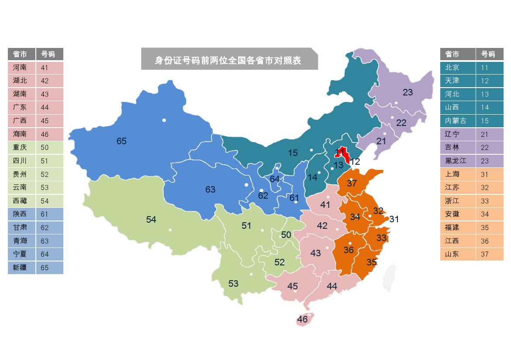

## 代码
``` js
function IdentityCodeValid(code) { 
        var city={11:"北京",12:"天津",13:"河北",14:"山西",15:"内蒙古",21:"辽宁",22:"吉林",23:"黑龙江 ",31:"上海",32:"江苏",33:"浙江",34:"安徽",35:"福建",36:"江西",37:"山东",41:"河南",42:"湖北 ",43:"湖南",44:"广东",45:"广西",46:"海南",50:"重庆",51:"四川",52:"贵州",53:"云南",54:"西藏 ",61:"陕西",62:"甘肃",63:"青海",64:"宁夏",65:"新疆",71:"台湾",81:"香港",82:"澳门",91:"国外 "};
        //var tip = "";
        var pass= true;
        
        //判断格式是否正确
        if(!code || !/^\d{2}(0[1-9]|[1-9][0-9])\d{2}((((1[6-9]|[2-9]\d)\d{2})(0[13578]|1[02])(0[1-9]|[12]\d|3[01]))|(((1[6-9]|[2-9]\d)\d{2})(0[13456789]|1[012])(0[1-9]|[12]\d|30))|(((1[6-9]|[2-9]\d)\d{2})02(0[1-9]|1\d|2[0-8]))|(((1[6-9]|[2-9]\d)(0[48]|[2468][048]|[13579][26])|((16|[2468][048]|[3579][26])00))0229))\d{3}(\d|x|X)$/i.test(code)){
            //tip = "身份证号格式错误";
            pass = false;
        }
        //判断前两位的地址编码是否正确
       	else if(!city[code.substr(0,2)]){
            //tip = "地址编码错误";
            pass = false;
        }
        else{
            //18位身份证需要验证最后一位校验位
            if(code.length == 18){
                code = code.split('');
                //∑(ai×Wi)(mod 11)
                //加权因子
                var factor = [ 7, 9, 10, 5, 8, 4, 2, 1, 6, 3, 7, 9, 10, 5, 8, 4, 2 ];
                //校验位
                var parity = [ 1, 0, 'X', 9, 8, 7, 6, 5, 4, 3, 2 ];
                var sum = 0;
                var ai = 0;
                var wi = 0;
                for (var i = 0; i < 17; i++)
                {
                    ai = code[i];
                    wi = factor[i];
                    sum += ai * wi;
                }
                var last = parity[sum % 11];
                if(parity[sum % 11] != code[17]){
                    //tip = "校验位错误";
                    pass =false;
                }
            }
        }
        return pass;
    }
```
:::danger 说明
一代身份证自2013年1月1日起停止使用
:::

## 正则分析
[在线分析-身份证号码](https://regexper.com/?#%2F%5E%5Cd%7B2%7D%280%5B1-9%5D%7C%5B1-9%5D%5B0-9%5D%29%5Cd%7B2%7D%28%28%28%281%5B6-9%5D%7C%5B2-9%5D%5Cd%29%5Cd%7B2%7D%29%280%5B13578%5D%7C1%5B02%5D%29%280%5B1-9%5D%7C%5B12%5D%5Cd%7C3%5B01%5D%29%29%7C%28%28%281%5B6-9%5D%7C%5B2-9%5D%5Cd%29%5Cd%7B2%7D%29%280%5B13456789%5D%7C1%5B012%5D%29%280%5B1-9%5D%7C%5B12%5D%5Cd%7C30%29%29%7C%28%28%281%5B6-9%5D%7C%5B2-9%5D%5Cd%29%5Cd%7B2%7D%2902%280%5B1-9%5D%7C1%5Cd%7C2%5B0-8%5D%29%29%7C%28%28%281%5B6-9%5D%7C%5B2-9%5D%5Cd%29%280%5B48%5D%7C%5B2468%5D%5B048%5D%7C%5B13579%5D%5B26%5D%29%7C%28%2816%7C%5B2468%5D%5B048%5D%7C%5B3579%5D%5B26%5D%2900%29%290229%29%29%5Cd%7B3%7D%28%5Cd%7Cx%7CX%29%24%2F "在线分析-身份证号码")


## 规则说明
:::tip 15位身份证号码组成
格式：`ddddddyymmddxxs`共15位
1. `dddddd`为6位的地方代码，根据这6位可以获得该身份证号所在地。
2. `yy`为2位的年份代码，是身份证持有人的出身年份。
3. `mm`为2位的月份代码，是身份证持有人的出身月份。
4. `dd`为2位的日期代码，是身份证持有人的出身日。
5. `xx`为2位的顺序码，这个是随机数。
6. `s`为1位的性别代码，奇数代表男性，偶数代表女性。
:::

:::tip 18位身份证号码组成
格式：`ddddddyyyymmddxxsp`共18位
1. `dddddd`为6位的地方代码，根据这6位可以获得该身份证号所在地。
2. `yyyy`为4位的年份代码，是身份证持有人的出身年份。
3. `mm`为2位的月份代码，是身份证持有人的出身月份。
4. `dd`为2位的日期代码，是身份证持有人的出身日。
5. `xx`为2位的顺序码，这个是随机数。
6. `s`为1位的性别代码，奇数代表男性，偶数代表女性。
7. `p`为校验位

其他部分都和15位的相同。年份代码由原来的2位升级到4位。最后一位为校验位。
:::

| 编号           | 说明                               | 规则                                                         |
| :------------- | :--------------------------------- | :----------------------------------------------------------- |
| 前1、2位数字   | 所在省（直辖市、自治区）的代码     | 规则见说明1                                                  |
| 第3、4位数字   | 所在地级市（自治州）的代码         | 从01到99                                                     |
| 第5、6位数字   | 所在区（县、自治县、县级市）的代码 | 从00到99                                                     |
| 第7—14位数字  | 出生年、月、日	4位年2位月2位日，   | 年从1900到2100，月从01到12，日从01到31                       |
| 第15、16位数字 | 所在地的派出所的代码               | 从00到99                                                     |
| 第17位数字     | 表示性别                           | 奇数表示男性（1、3、5、7、9），偶数表示女性（0、2、4、6、8） |
| 第18位数字     | 校检码                             | 它是用来检验身份证的正确性。规则见说明2                      |

## 所在省（直辖市、自治区）的代码
| 代码  | 地区                 | 代码  | 地区              |
| ----- | -------------------- | ----- | ----------------- |
| 11-15 | 京 津 冀 晋 蒙       | 21-23 | 辽 吉 黑          |
| 31-37 | 沪 苏 浙 皖 闽 赣 鲁 | 41-46 | 豫 鄂 湘 粤 桂 琼 |
| 50-54 | 渝 川 贵 云 藏       | 61-65 | 陕 甘 青 宁 新    |
| 81-82 | 港 澳                | 71    | 台湾              |



## 校验码规则
1. 十七位数字本体码加权求和公式
- `S = Sum(Ai * Wi), i = 0, … , 16` ，先对前17位数字的权求和
- `Ai`:表示第i位置上的身份证号码数字值
- `Wi`:表示第i位置上的加权因子
- `Wi`: 7 9 10 5 8 4 2 1 6 3 7 9 10 5 8 4 2
2. 计算模
- `Y = mod(S, 11)`
3. 通过模得到对应的校验码
- `Y: 0 1 2 3 4 5 6 7 8 9 10`
- 校验码: `1 0 X 9 8 7 6 5 4 3 2`

也就是说，如果得到余数为1则最后的校验位p应该为对应的0.如果校验位不是，则该身份证号码不正确。

## 参考资料
[全国公民身份证号码查询服务中心](http://www.nciic.com.cn/framework/gongzuo/index.jsp "全国公民身份证号码查询服务中心")
