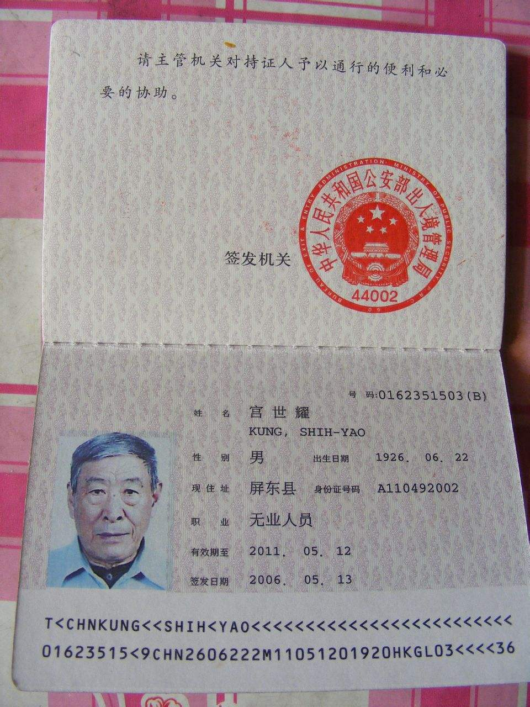
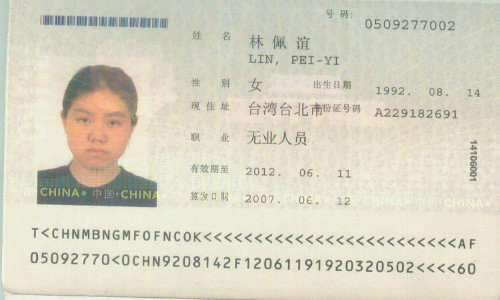

## 代码
``` js
  /^\d{8,10}(\([A-Z,0-9]{1}\))?$/
```

## 正则分析
[在线分析-台胞证号](https://regexper.com/?#%2F%5E%5Cd%7B8%2C10%7D%28%5C%28%5BA-Z%2C0-9%5D%7B1%7D%5C%29%29%3F%24%2F "在线分析-台胞证号")


## 规则说明
:::tip 说明
台胞证号码实行“一人一号、终身不变”，保留现行台胞证号码中前8位台胞终身号码.
其号码由台胞终身号、签发次数、签发机关代码三部分组成，证件号码前八位阿拉伯数字为台胞终身号，后两位为签发证件的次数，括号内的英文字母或者阿拉伯数字为签发机关代码。
:::
| 类型 | 说明                       | 备注                  |
| :--- | :------------------------- | :-------------------- |
|      | 8位数字或者10位数字        |                       |
|      | 最后可以有括号，也可以没有 | 如：`0162351503（B）` |



## 参考资料
[台湾居民来往大陆通行证](https://baike.baidu.com/item/%E5%8F%B0%E6%B9%BE%E5%B1%85%E6%B0%91%E6%9D%A5%E5%BE%80%E5%A4%A7%E9%99%86%E9%80%9A%E8%A1%8C%E8%AF%81?fromtitle=%E5%8F%B0%E8%83%9E%E8%AF%81&fromid=10584345)