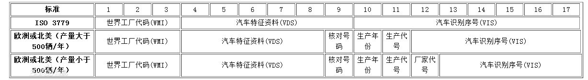

## 代码
``` js
	var reg = /^[\dABCDEFGHJKLMNPRSTUVWXYZ]{17}$/;
	var reg2 = /^([\dABCDEFGHJKLMNPRSTUVWXYZ])\1{16}$/;
```

## 正则分析
[在线分析-车架号](https://regexper.com/?#%2F%5E%5B%5CdABCDEFGHJKLMNPRSTUVWXYZ%5D%7B17%7D%24%2F "在线分析-车架号")


## 规则说明

| 类型 | 说明                              | 备注 |
| :--- | :-------------------------------- | :--- |
|      | 车架号长度为17位                  |      |
|      | 只能含有数字和除I、O、Q以外的字母 |      |
|      | 并且字母全为大写                  |      |
|      | 号不能为17位连续相同的数字或字母  |      |

## 车架号编码标准

不同国家或汽车生产厂家，其VIN含义有细微的不同，可以仔细阅读下面的文档。

## 参考资料
[车架号](https://baike.baidu.com/item/%E8%BD%A6%E8%BE%86%E8%AF%86%E5%88%AB%E5%8F%B7%E7%A0%81/4338309?fr=aladdin&fromtitle=%E8%BD%A6%E6%9E%B6%E5%8F%B7&fromid=1228700#3)