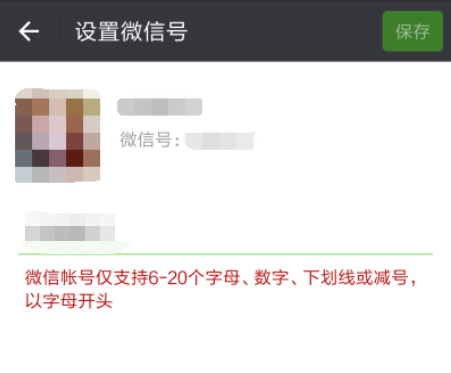

## 代码
``` js
/^[a-zA-z](\w|_|-){5,19}$/
```

## 正则分析
[在线分析-微信号](https://regexper.com/?#%2F%5E%5Ba-zA-z%5D%28%5Cw%7C_%7C-%29%7B5%2C19%7D%24%2F "在线分析-微信号")


## 规则说明
| 类型 | 说明                     | 备注 |
| :--- | :----------------------- | :--- |
| -    | 6-20位                   |      |
| -    | 字母、数字、下划线或减号 |      |
| -    | 以字母开头               |      |

