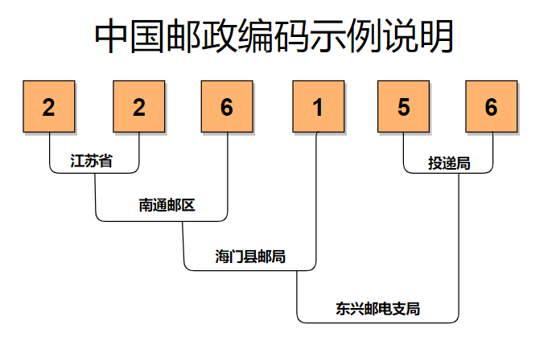

## 代码
``` js
/^[0-9]{6}$/
```

## 正则分析
[在线分析-邮编](https://regexper.com/#%2F%5E%5B0-9%5D%7B6%7D%24%2F "在线分析-邮编")


## 规则说明
:::tip
中国目前采用的邮政编码为“四级六码\”制。即每组编码由六位阿拉伯数字组成，这六位数字分别表示省（自治区、直辖市）、邮区、县（市）邮电局和投递局（区）四级。六位数的前两位代表省（自治区、直辖市），第三位代表邮区，第四位代表县（市）邮电局，最后两位是投递局（区）的编号。
:::

| 类型 | 说明      | 备注 |
| :--- | :-------- | :--- |
| -    | 6位纯数字 |      |



## 参考资料
[邮编库](https://www.youbianku.com/%E9%A6%96%E9%A1%B5 "邮编库")
